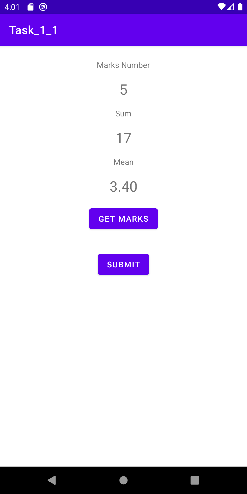
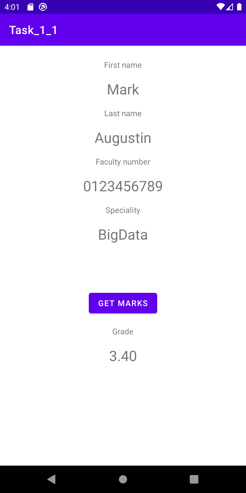

# Task_1_1
## Content
Passing parameters between Intents. 

Features:
* Pass arguments between Intents
  * startActivity(Intent)
  * startActivityForResult()
* Validation on lost focus:
  * Use regex to validate fields
  * `First name` and `Last name` - every first letter is capital
  * `Faculty number` - 10 numbers
  * `Specialty` - select from drop down list
  * Button `Submit` must be disabled until the data are valid
* Use case 
  1. Take data from user
  2. Validate input data
  3. Pass data to the another view
  4. Go to third view waiting as startActivityForResult
  5. Finish third view and return arguments to second view

## Screenshots
### View not valid

### View valid

### Result from first form

### Make calculation in another activity

### Pass arguments to parent

<!--  -->

