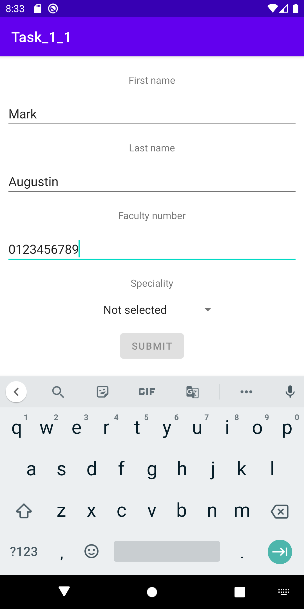
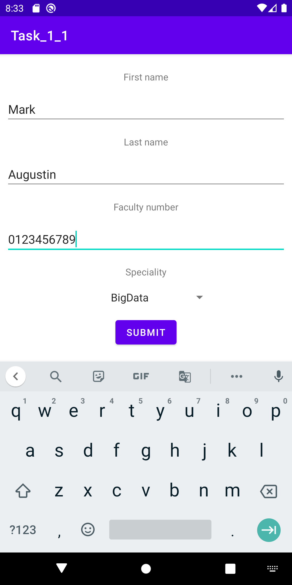
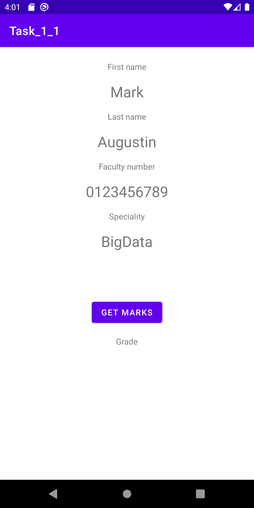

# Task_1_1
## Content
Passing parameters between Intents. 

Features:
* 2 fragments
* Pass arguments between fragments
* Validation on lost focus:
  * Use regex to validate fields
  * `First name` and `Last name` - every first letter is capital
  * `Faculty number` - 10 numbers
  * `Specialty` - select from drop down list
  * Button `Submit` must be disabled until the data are valid
* Use case 
  1. Take data from user
  2. Validate input data
  3. Pass data to the another view

## Screenshots
### View not valid

### View valid

### Result

<!--  -->

