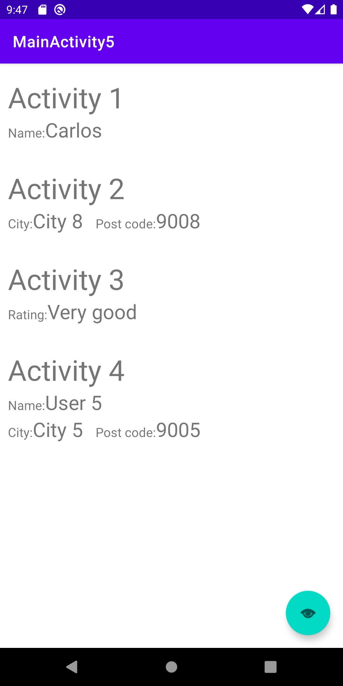

# Task_2
## Content
Application is focused on Adapter elements. 

Used adapters:
* BaseAdapter
* ArrayAdapter
* Custom ArrayAdapter

Features:
* 5 Activities
1. The first Activity contains a text box for entering a name when you press the forward button it passes it to the next activation.
2. The second Activity contains a list of zip codes and regional centers use BaseAdapter, after selecting a row from the list and pressing the forward button to send to the next asset data filled in all the steps.
3. The third Activity contains a list of cities in the selected area use ArrayAdapter, after selecting a row from the list and pressing the forward button to send to the next asset data filled in all the steps.
4. The fourth Activity displays a list of parcel sizes and transport price, Custom ArrayAdapter, after selecting an order from the list and pressing the forward button to send to the next asset data completed by all steps.
5. The fifth activity to display the selected information

## Links
* Assignment details [link](https://tu-varna.gitbook.io/programmingwithjava/android-basics/laboratorno-uprazhnenie-7/zadacha).
* BaseAdapter description [link](https://tu-varna.gitbook.io/programmingwithjava/android-basics/laboratorno-uprazhnenie-7/baseadapter)
* ArrayAdapter description [link](https://tu-varna.gitbook.io/programmingwithjava/android-basics/laboratorno-uprazhnenie-7/arrayadapter)
* Custom ArrayAdapter description [link](https://tu-varna.gitbook.io/programmingwithjava/android-basics/laboratorno-uprazhnenie-7/custom-arrayadapter)

## Screenshots
### Activity 1 - Name

### Activity 2 - City

### Activity 3 - Rating

### Activity 4 - User

### Activity 5 - Preview of selected elements

<!--  -->

