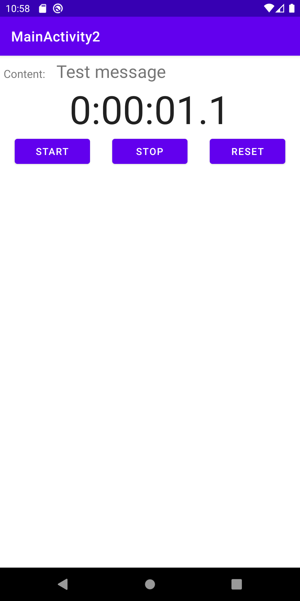

# Task_4
## Content
Application is focused on Threads. 

Features:
* Threads
    * Runnable 
    * HandlerThread 
    * ThreadPoolExecutor 

Assignment acceptance criteria:
* Create an Activity with an email input field, progress control and button.

    * Pressing the button starts the progress control and checks the validity of the email. (Simulate a pending server check)

    * If the result is unsuccessful, an error message is displayed

    * If the result is successful, the email is sent to a second Activity with a text box with an initialized stopwatch and buttons Start, Stop, Reset

    * The start button starts the timer

    * The stop button stops the stopwatch

    * The reset button reset the stopwatch without stopping it

## Links
University sources:
* Assignment details [link](https://tu-varna.gitbook.io/programmingwithjava/android-basics/laboratorno-uprazhnenie-9/zadacha).

* Threads introduction [link](https://tu-varna.gitbook.io/programmingwithjava/android-basics/laboratorno-uprazhnenie-9)
* Runnable [link](https://tu-varna.gitbook.io/programmingwithjava/android-basics/laboratorno-uprazhnenie-9/runnable)
* HandlerThread [link](https://tu-varna.gitbook.io/programmingwithjava/android-basics/laboratorno-uprazhnenie-9/handlerthread)
* ThreadPoolExecutor description [link](https://tu-varna.gitbook.io/programmingwithjava/android-basics/laboratorno-uprazhnenie-9/threadpoolexecutor)

* HTML of the pages is stored also in `Readme/Task_4.7z` archive

* Stopwatch App description [link](https://www.geeksforgeeks.org/how-to-create-a-stopwatch-app-using-android-studio/)

<!-- Other sources: -->
<!-- * xxx [link](xxx) -->

## Screenshots
### Activity 1 - Main message view

### Activity 1 - Sending message progress bar

### Activity 1 - Sending message failed

### Activity 2 - Started stopwatch

<!--  -->

