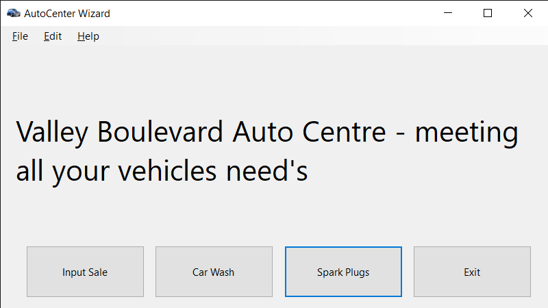
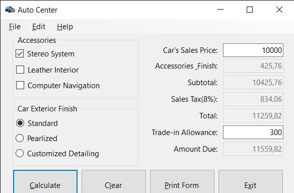
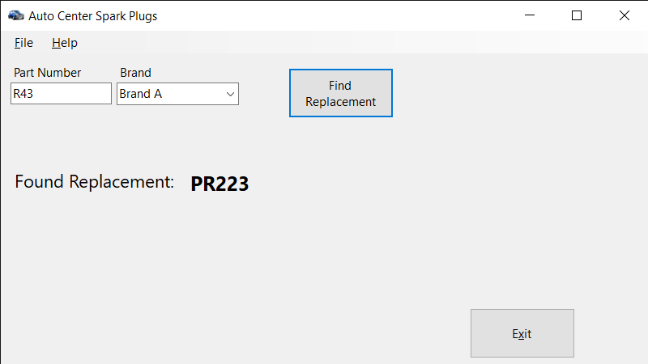
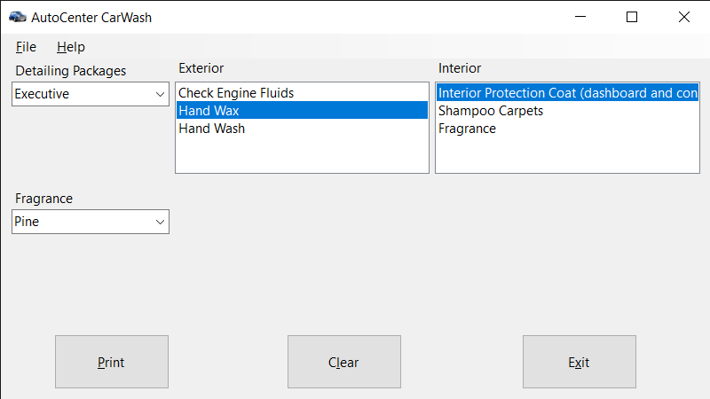

# SOFTWARE ENGINEERING

## C# course
Laboratory part will be based on C# Windows forms coursse [http://zebra0.com/csharp/index.php](http://zebra0.com/csharp/index.php)

Module 2 is read but not reproduced because of errors

## C# Windows Forms Programming Assignment
The description of the assignment is presented in file [Readme/Windows_Forms_assignment.pdf](Software_project/Windows_Forms_assignment.pdf)

### Screenshots

#### Main view

#### Cars sale window

#### Spark plugs window

#### Car wash window

